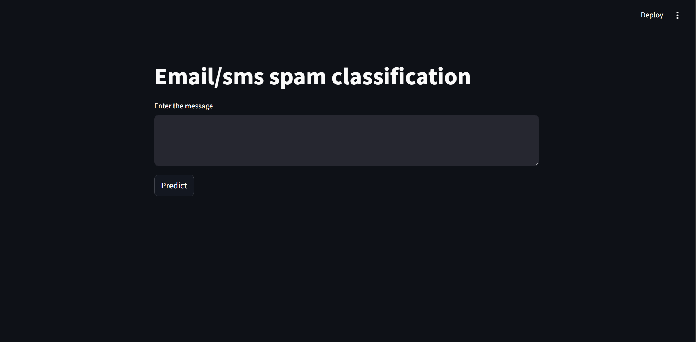

# 📩 SMS Spam Detection App

A Machine Learning web application that detects whether an SMS or Email
message is **Spam** or **Not Spam** using **Natural Language Processing
(NLP)** and **TF-IDF Vectorization**.\
The application is built using Python, Scikit-learn, and Streamlit,
allowing users to enter any message and receive instant predictions.

------------------------------------------------------------------------

## 🚀 Features

-   Real-time spam detection
-   Clean NLP preprocessing pipeline
-   Interactive web interface using Streamlit
-   Lightweight and fast prediction system

------------------------------------------------------------------------

## 🖥️ App Interface


    

------------------------------------------------------------------------

## 📊 Model Performance

-   **Algorithms:** Bernoulli Naive Bayes + Support Vector Machine + ExtraTree Elassifier  using Voting algo.
-   **Feature Extraction:** TF-IDF Vectorizer
-   **Problem Type:** Binary Classification (Spam / Not Spam)


-   Accuracy: 0.9845261121856866
-   Precision: 1.0


------------------------------------------------------------------------

## 🧠 Machine Learning Workflow

### Pipeline

Text → Preprocessing → TF-IDF Vectorization → Trained ML Model →
Prediction

### 1. Data Preprocessing

-   Convert text to lowercase
-   Tokenization using NLTK
-   Remove punctuation and special characters
-   Remove stopwords
-   Apply stemming using SnowballStemmer

### 2. Feature Engineering

-   Used TF-IDF Vectorizer to convert text into numerical vectors

### 3. Model Training

-   Algorithm: Bernoulli Naive Bayes
-   Library: Scikit-learn
-   Model serialization using Pickle

### 4. Deployment

-   Built an interactive web app using Streamlit

------------------------------------------------------------------------

## 🛠️ Tech Stack

-   Python
-   Scikit-learn
-   NLTK
-   Streamlit
-   Pandas
-   NumPy
-   Pickle

------------------------------------------------------------------------

## 📂 Project Structure

    SMS-Spam-Detection/
    │
    ├── app.py                  # Streamlit web app
    ├── model.pkl               # Trained ML model
    ├── vectorizer.pkl          # TF-IDF vectorizer
    ├── Sms_spam_detection.ipynb # Model training notebook
    ├── requirements.txt        # Project dependencies
    └── README.md               # Project documentation

------------------------------------------------------------------------

## ⚙️ Installation & Setup

### 1. Clone Repository

``` bash
git clone https://github.com/Vinay-Rai/SMS-spam-classification-APP.git
cd SMS-spam-classification-APP
```

### 2. Install Dependencies

``` bash
pip install -r requirements.txt
```

### 3. Run Application

``` bash
streamlit run app.py
```

Application runs at:

    http://localhost:8501

------------------------------------------------------------------------

## 💡 Example Messages

### Spam Messages

-   "Congratulations! You have won ₹10,000. Claim now."
-   "Your loan is approved. Apply immediately."

### Not Spam Messages

-   "Are you coming to class today?"
-   "Let's meet at 6 pm."

------------------------------------------------------------------------

## 🌍 Deployment

The application is deployed on Streamlit Community Cloud.


------------------------------------------------------------------------

## 🎯 Future Improvements

-   Improve model accuracy using advanced NLP models (Word2Vec, BERT)
-   Add prediction confidence score
-   Support bulk message classification
-   Enhance UI design
-   Email spam detection support

------------------------------------------------------------------------

## 👨‍💻 Author

Vinay\
- Machine Learning Enthusiast\
- Interested in NLP and Deep Learning

(Add your GitHub and LinkedIn links)
Github -- >  https://github.com/Vinay-Rai

Linkedin-->  www.linkedin.com/in/vinay-rai-24vr


------------------------------------------------------------------------

## ⭐ Support

If you like this project, please give it a ⭐ on GitHub and share it
with others!
